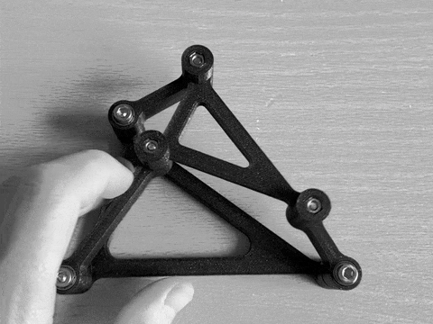
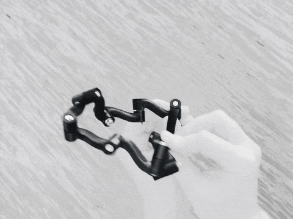

---
---
Welcome to a small animated collection of mechanism prototypes I’ve made. If you want to reach out, use the [contact form](https://docs.google.com/forms/d/e/1FAIpQLSfuRs3_uNcINh2yRX_F4iCAaxD1PlyUjmmNVjVHe6W_Tt3u5w/viewform?usp=dialog).

You can also visit my [GitHub](https://github.com/hucik14) · [Google Scholar](https://scholar.google.com/citations?user=5sNQdNMAAAAJ) · [Printables](https://www.printables.com/@hucik14_497869) profiles.

---

  

  

    <h3>Moveable 4R</h3>
    

      Lorem ipsum text lorem ip sum text. Lorem ipsum text lorem ip sum text. Lorem ipsum text lorem ip sum text. Lorem ipsum text lorem ip sum text.Lorem ipsum text lorem ip sum text. Lorem ipsum text lorem ip sum text. Lorem ipsum text lorem ip sum text. Lorem ipsum text lorem ip sum text. Lorem ipsum text lorem ip sum text.Lorem ipsum text lorem ip sum text. Lorem ipsum text lorem ip sum text. Lorem ipsum text lorem ip sum text. Lorem ipsum text lorem ip sum text. Lorem ipsum text lorem ip sum text.Lorem ipsum text lorem ip sum text.
    

  

   

Paper: [paper.link](https://github.com/hucik14/hucik14.github.io/blob/main/LICENSE)  
Video: [video.link](https://github.com/hucik14/hucik14.github.io/blob/main/LICENSE)

---

  

  

    <h3>Shaky 3-RPR</h3>
    

      The structure shall be rigid (imagine pneumatic actuators in the legs), however it is shaky (moving in a range) because the direct kinematics solutions coicide. 
      It was proposed by Manfred Husty. 
    

  

Husty, M. (2023), Multiple Solutions of Direct Kinematics of 3-RPR Parallel Manipulators.  
Paper DOI: [10.1007/978-3-031-45705-0_58](https://doi.org/10.1007/978-3-031-45705-0_58) 

---

  

  

    <h3>9R with 1 DoF</h3>
    

      This 9R is supposed to have 3 DoFs, but has only 1 as the axes form a discrete Möbius strip. 
      It was proposed by Manfred Husty. 
    

  

Husty, M. (2022), Möbius Linkages.  
Paper DOI: [10.1007/978-3-031-08140-8_1](https://doi.org/10.1007/978-3-031-08140-8_1) 

---

## License

Site code: MIT (see [LICENCE](https://github.com/hucik14/hucik14.github.io/blob/main/LICENSE))  
Content (text/images/gifs): CC BY-NC 4.0 (see [LICENCE-CONTENT](https://github.com/hucik14/hucik14.github.io/blob/main/LICENSE-CONTENT))
